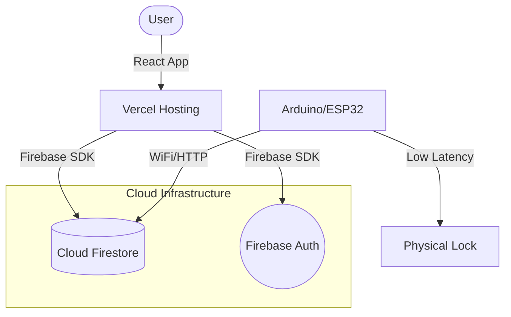

# 🔐 Securefy: Smart Locker System

**Securefy** is a state-of-the-art, IoT-integrated locker management solution. Built with a **React 19** frontend and **Firebase** backend, it provides a seamless user experience for booking, managing, and accessing lockers via QR codes.

---

## 🚀 Key Features

*   **Real-Time Availability**: Instantly check locker status (Available, Occupied, Reserved) across multiple floors.
*   **Secure QR Booking**: Single-use, time-sensitive QR codes generated for every booking to ensure maximum security.
*   **IoT Integration**: Direct communication with Arduino/ESP32 hardware for automated physical locker control.
*   **Admin Dashboard**: Centralized management for lockers, users, and booking logs.
*   **Responsive Design**: Fully optimized for mobile, tablet, and desktop viewing.

---

## 🏗️ Project Architecture



---

## 📂 File Structure

The project has been refactored for maximum clarity and compatibility with Vercel deployment:

```text
Securefy/
├── src/                # ⚛️ Core React Application
│   ├── components/     # Reusable UI components (Shared)
│   ├── pages/          # Individual pages (Home, Availability, Booking)
│   ├── services/       # Firebase logic and QR generation
│   ├── context/        # Global state management (AuthContext)
│   └── styles/         # Global & component-specific CSS
├── public/             # 🖼️ Static assets (Logos, Icons)
├── arduino/            # 📟 Hardware-side C++ code for locker control
├── dist/               # ✨ Production-ready build (Auto-generated)
├── package.json        # 📦 Project dependencies & scripts
├── vite.config.js      # ⚙️ Vite configuration
└── README.md           # 📖 Documentation
```

---

## 🛠️ Technology Stack

| Layer | Technology |
| :--- | :--- |
| **Frontend** | React 19, Vite, React Router 7, React Icons |
| **Styling** | Vanilla CSS (Glassmorphism & Professional UI) |
| **Backend** | Firebase Firestore (Real-time DB), Firebase Auth |
| **Hardware** | Arduino / ESP32 (C++ with WiFi connectivity) |
| **Deployment** | Vercel (Frontend), Firebase (Database & Cloud) |

---

## 🚦 Getting Started

### 1. Prerequisites
- **Node.js** (v18 or higher)
- **Firebase CLI** (`npm install -g firebase-tools`)
- **Arduino IDE** (for hardware setup)

### 2. Local Setup
1. Clone the repository and navigate to the project root:
   ```bash
   npm install
   ```
2. Create your Firebase project in the [Firebase Console](https://console.firebase.google.com).
3. Update `src/firebase.js` with your specific Firebase configuration.
4. Start the development server:
   ```bash
   npm run dev
   ```

### 3. Hardware Configuration
- Open `arduino/locker_system.ino` in the Arduino IDE.
- Configure your WiFi credentials and your Firebase database URL.
- Upload to your ESP32/Arduino board.

---

## 🌐 Deployment

### Frontend (Vercel)
This project is pre-configured for **Vercel**. 
1. Connect your GitHub repository to Vercel.
2. Ensure the **Framework Preset** is set to `Vite`.
3. Set the **Build Command** to `npm run build`.

### Database (Firebase)
1. Set your Firestore security rules to allow authenticated users to read/write their own bookings.
2. Enable **Authentication** (Email/Password).

---

## 🤝 Contributing
Contributions are welcome! Please feel free to submit a Pull Request.

---

*Made with ❤️ for a smarter, more secure future.*
